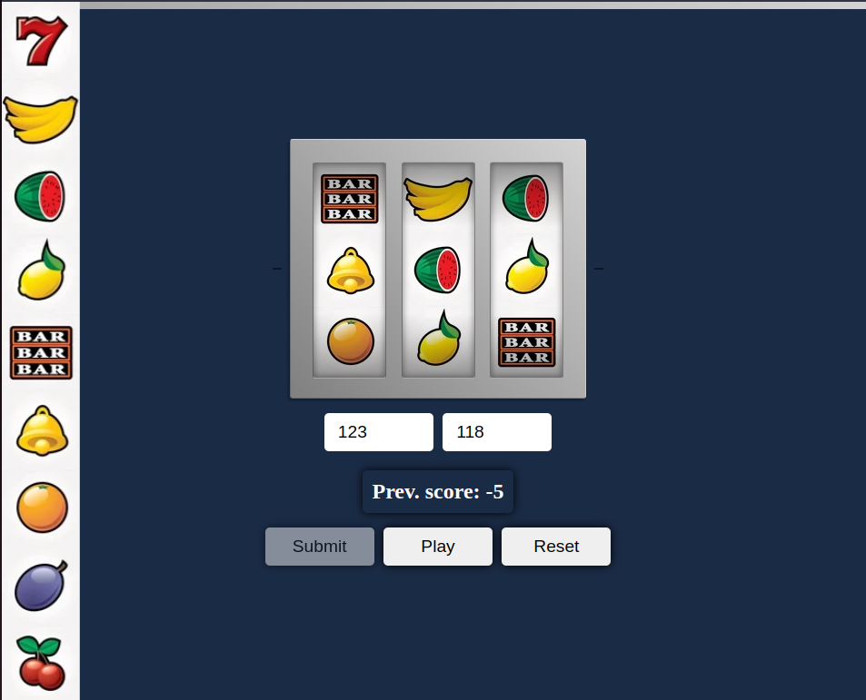

# JavaScript-Slot-Machine

Slot machine, also known as a "one-armed bandit" or "fruit machine," is a popular form of gambling where players place bets on the random outcomes of the reels' spin on the machine. Here's a brief description of playing a slot machine:

1. Reels and Symbols: The gaming machine has a set of reels (typically three to five) with various symbols like fruits, bells, numbers, or cards.

2. Bet and Spins: A player begins by placing a bet before each spin of the reels. After placing the bet, the player presses a button or pulls a lever, initiating the spin of the reels.

3. Randomness: The outcome of the spin is entirely random, based on a pseudo-random number generator. Symbols stop on the screen in a random manner, determining the result.

## [Text version](Text_version/)

This is very simple text game where user can bet some amount of 'money' on defined number of lines in slot machine.
A winning depends on the combination of letters that occurs after shuffle.

Remember to install NodeJS and npm:
```sh
sudo apt install nodejs
sudo apt install npm
```

## [Animated version](Animated_version/)

The animated version of this simple game can be quite pleasant.

How to play:
- place Your bet and hit 'Select' button
- cross Your fingers and hope for winning symbol combinations
- collect points in three different ways:
    - ( 2 <span>&#215;</span> sum of points for each symbol ) if there are three of them in center
    - ( 2 <span>&#215;</span> points of one symbol ) if there are two of them by left or right
    - ( 2 <span>&#215;</span> points of one symbol - 1 ) if there are two of them by left or right
    - when there are no matching symbols You lose 5 points
- when You ran out of deposit the game stops
- hit 'Reset' button for a new start





